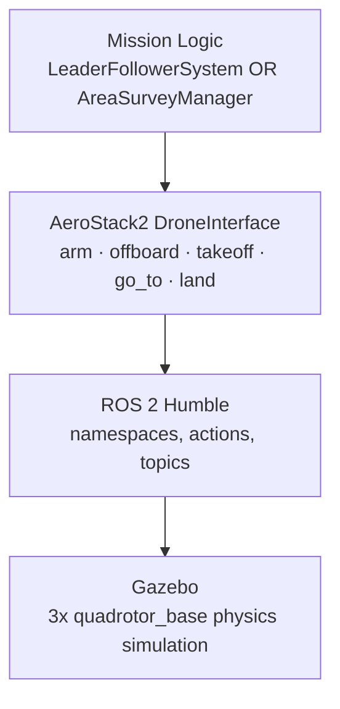

# AeroStack2 Multi-Drone Systems

**Multi-drone autonomous flight with AeroStack2, ROS 2 Humble, and Gazebo — formation control and dynamic, fault-tolerant task reallocation.**


---

## Overview

This repository contains two related multi-drone simulation systems built on the same [AeroStack2](https://github.com/aerostack2/aerostack2) / ROS 2 Humble / Gazebo stack, using three simulated quadrotors (`drone0`, `drone1`, `drone2`) coordinated from a single Python process.

| | Project | What it demonstrates |
|---|---|---|
| 1 | **[Leader-Follower Formation Control](formation_control/)** | Synchronized multi-drone formation flight using fixed geometric offsets and concurrent, thread-based command dispatch. |
| 2 | **[Dynamic Task Reallocation](dynamic_reallocation/)** | Runtime mission resilience: detecting a delayed drone, preempting a busy helper, transferring unfinished work, and resuming the helper's own interrupted mission — all with zero duplicated or lost work. |

Project 2 is built on the same workspace, launch tooling, and verification methodology established in Project 1, extending it from **static coordination** to **adaptive, fault-tolerant task orchestration**.

---

## Demo Evidence

Full validated console runs, ROS 2 interface verification, and step-by-step screenshots for both systems are in [`docs/`](docs/):

- [`docs/formation-control.md`](docs/formation-control.md) — full formation-control report
- [`docs/dynamic-reallocation.md`](docs/dynamic-reallocation.md) — full dynamic-reallocation report, including the delay → preemption → transfer → resume sequence

Sample from the dynamic reallocation run:

```
DYNAMIC TASK REALLOCATION
Drone0 = DELAYED
Area A completed: 2/4
...
PREEMPTING BUSY HELPER
Selected helper: drone2
...
REALLOCATION COMPLETE
drone2 completed Drone0's remaining Area A work.
drone2 also completed its original Area C work.

FINAL MISSION VERIFICATION
Area A: 4/4
Area B: 4/4
Area C: 4/4
Dynamic reallocation: COMPLETED
Helper drone: drone2

MISSION COMPLETED SUCCESSFULLY
```

---

## Project 1: Leader-Follower Formation Control

One leader drone (`drone0`) flies a predefined 5-waypoint square route; two followers (`drone1`, `drone2`) track it at fixed `(x, y, z)` offsets, maintaining a rigid triangular formation throughout.

**Key capabilities**
- Three independent `DroneInterface` objects under separate ROS 2 namespaces in one process
- Sequential arm/offboard preparation, concurrent takeoff / GoTo / landing via one Python thread per drone
- Deterministic, waypoint-synchronized formation geometry from fixed relative offsets
- GoTo action feedback (`actual_speed`, `actual_distance_to_goal`) used as evidence of genuine in-transit motion

→ [`formation_control/README.md`](formation_control/README.md) for setup and run instructions.

---

## Project 2: Dynamic Multi-Drone Task Reallocation

Three drones survey three independent regions concurrently. A central Mission Manager detects a deliberately simulated delay on `drone0`, identifies its unfinished waypoints, selects a helper (preempting a busy one if no idle drone is available), transfers the unfinished work, and resumes the helper's own original survey afterward.

**Key capabilities**
- Central `AreaSurveyManager` coordinating delay detection, helper selection, preemption, and transfer
- Asynchronous (non-blocking) GoTo execution, required for responsive mid-flight preemption
- Global, area-level completion accounting decoupled from drone ownership (a region can be finished by more than one physical drone without double-counting)
- Formal per-drone state machine: `SURVEYING → DELAYED → PREEMPTED → REASSIGNED → TRANSFERRED → AVAILABLE`
- Full mission-level verification before landing

→ [`dynamic_reallocation/README.md`](dynamic_reallocation/README.md) for setup and run instructions.

---

## System Architecture

Both projects share the same layered architecture; they differ only in the Mission Logic layer:



See [`docs/architecture.md`](docs/architecture.md) for the full breakdown, including the per-drone state machine used in Project 2.

---

## Tech Stack

| Item | Configuration |
|---|---|
| Operating System | Ubuntu 22.04 LTS |
| Middleware | ROS 2 Humble |
| Simulator | Gazebo |
| Framework | AeroStack2 |
| Programming | Python 3 / rclpy |
| Drone API | AeroStack2 `DroneInterface` |
| Drone model | `quadrotor_base` |

---

## Setup & Installation

**Prerequisites**
- Ubuntu 22.04 with ROS 2 Humble installed
- [AeroStack2](https://github.com/aerostack2/aerostack2) built in a local workspace
- Gazebo (bundled with a standard AeroStack2 install)

**Clone this repository**

```bash
git clone https://github.com/<your-username>/aerostack2-multi-drone-systems.git
cd aerostack2-multi-drone-systems
```

**Source the environment** (run before every session — adjust the workspace path to your own AeroStack2 install):

```bash
source /opt/ros/humble/setup.bash
source ~/aerostack2_ws/install/setup.bash
```

**Launch options.** The `scripts/` folder holds thin wrappers around AeroStack2's own launch tooling for a 3-drone Gazebo world:

```bash
./scripts/launch_as2.bash -m                 # launch Gazebo + AeroStack2 (multi-drone mode)
./scripts/launch_ground_station.bash -m -v   # optional: live ground-station viewer
./scripts/stop.bash                          # stop the simulation
```

> These scripts are templates for this repository's layout. Point `WORKSPACE` and `WORLD_CONFIG` in each script at your own AeroStack2 workspace and world file — see [`scripts/README.md`](scripts/README.md).

---

## Running Each Project

**Formation control:**
```bash
./scripts/launch_as2.bash -m
python3 formation_control/leader_follower_mission.py
```

**Dynamic task reallocation:**
```bash
./scripts/launch_as2.bash -m
python3 dynamic_reallocation/area_survey.py
```

Full step-by-step instructions, parameters, and expected output are in each project's own README.

---

## Validation Results Summary

| Check | Formation Control | Dynamic Reallocation |
|---|---|---|
| Drone interface init (3x) | ✅ | ✅ |
| Concurrent takeoff | ✅ | ✅ |
| Mission waypoints completed | 5/5 (all 3 drones) | Area A 4/4 · Area B 4/4 · Area C 4/4 |
| Fault handling exercised | N/A (static formation) | ✅ delay detected → helper preempted → work transferred → helper resumed |
| Landing | ✅ all 3 `LAND SUCCESS` | ✅ all 3 `LAND SUCCESS` |
| Final message | `FORMATION MISSION COMPLETED SUCCESSFULLY` | `MISSION COMPLETED SUCCESSFULLY` |

---

## Engineering Notes

- **Async vs. blocking GoTo:** Formation control uses a straightforward GoTo call per waypoint. Dynamic reallocation *requires* asynchronous GoTo (`wait=False`) with a polling loop, since the Mission Manager must be able to interrupt a drone's flight mid-waypoint to preempt it — a blocking call would make that impossible.
- **API signature debugging:** the correct call is `go_to.go_to(x, y, z, speed, frame_id)` (formation) — tracing the right submodule method was a real debugging step during development, not assumed from documentation.
- **Ownership vs. completion:** the reallocation system tracks waypoint completion globally, by `(area, index)`, independent of which physical drone executed it. This is what allows Area A to be finished by two different drones without any double-counting or ambiguity in final verification.
- **Thread safety:** every piece of per-drone mutable state (`mission_state`, `completed_indices`, `preempt_requested`) is guarded by a `threading.Lock`, since each drone's survey runs on its own thread concurrently with the Mission Manager.

---

## Future Work

- Port from fixed-offset formation to a live pose-feedback controller (continuous tracking rather than waypoint-synchronized offsets)
- Support multiple simultaneous delayed drones and multi-helper reallocation
- Real-hardware validation on a PX4-based multi-drone testbed
- Formal mission-replay / log-based test harness for regression testing

---

## Acknowledgments

Built on the [AeroStack2](https://github.com/aerostack2/aerostack2) framework, ROS 2, and Gazebo.

## License

MIT — see [LICENSE](LICENSE).
