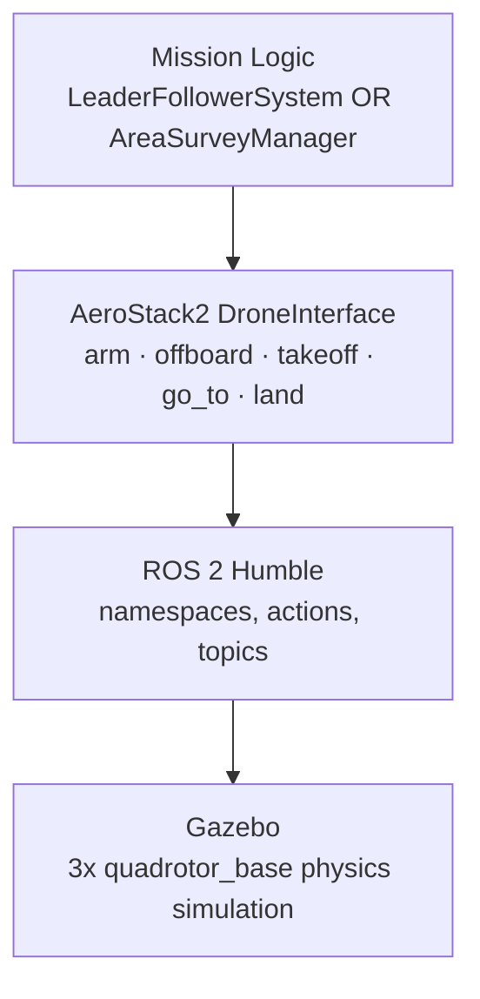
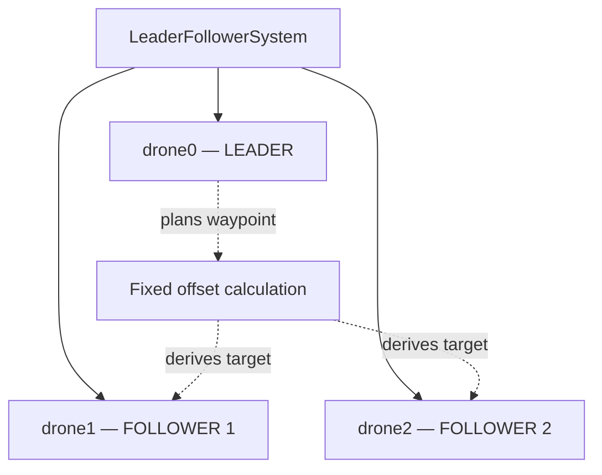
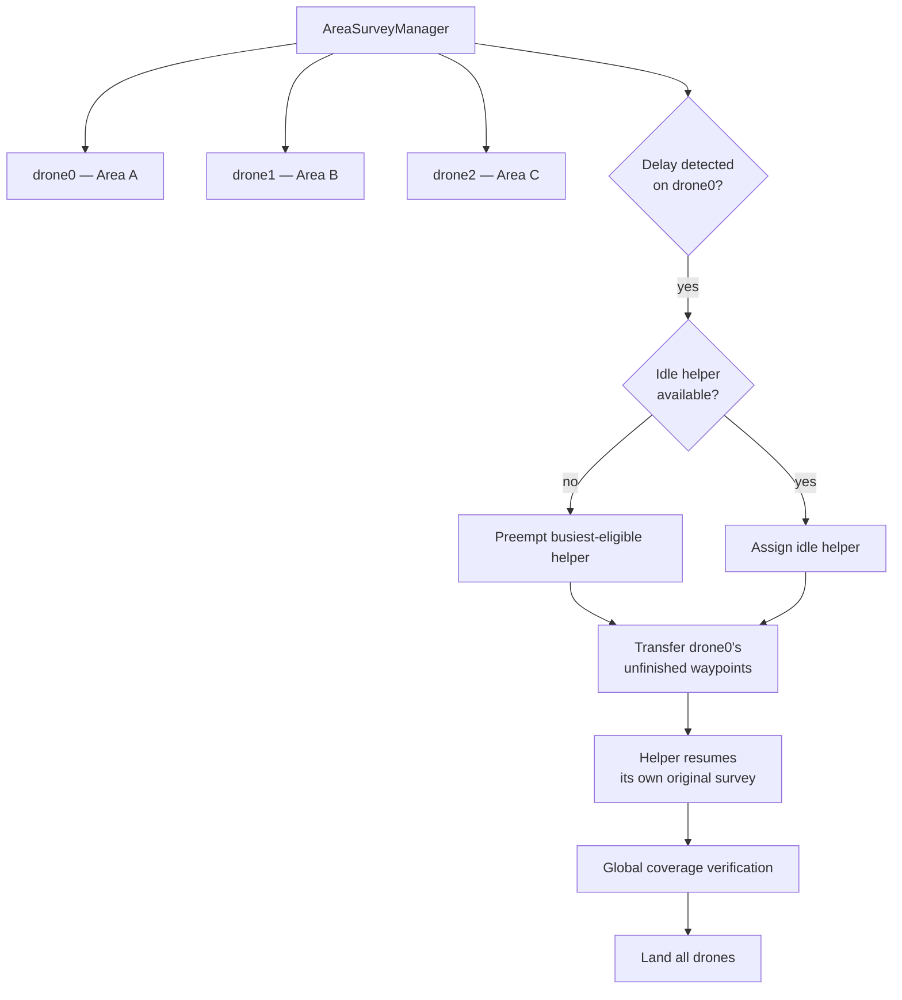
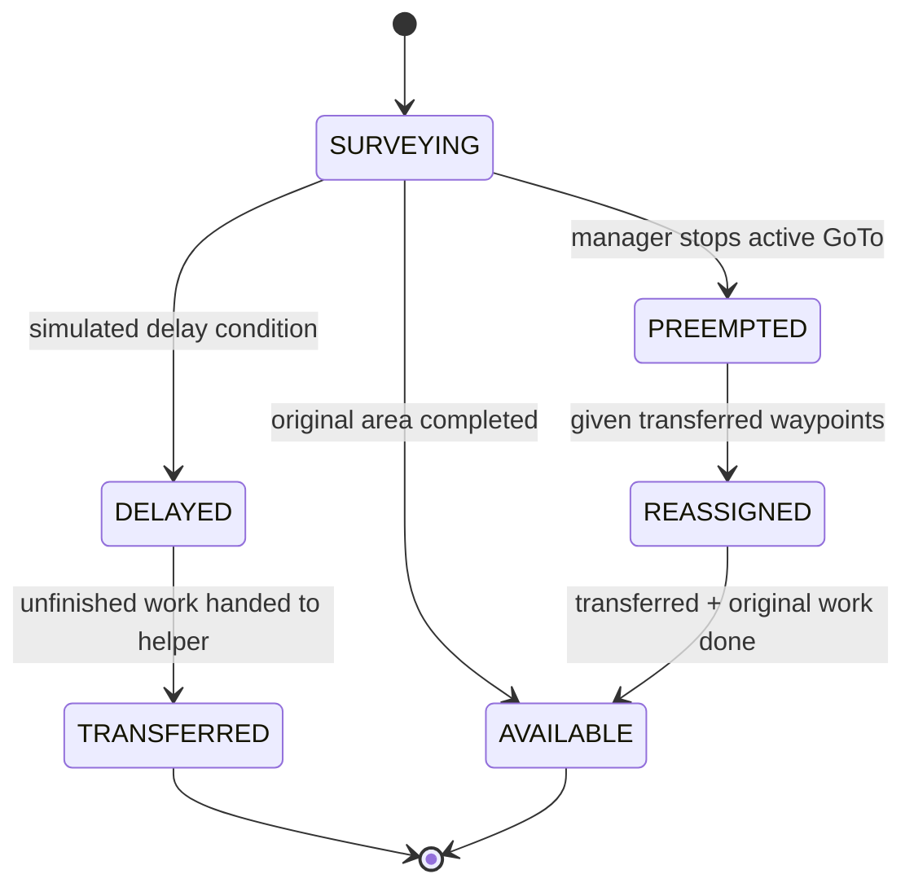

# System Architecture

Both projects in this repository share the same underlying layered architecture. They diverge only at the top "Mission Logic" layer — one implements static formation control, the other implements dynamic, fault-tolerant task reallocation.

## Shared Layer Stack

| Layer | Responsibility |
|---|---|
| Mission Logic | Coordinates assignments, mission sequencing, and (in Project 2) delay detection, helper selection, preemption, and verification. |
| AeroStack2 `DroneInterface` | Provides `arm()`, `offboard()`, `takeoff()`, `go_to()`, `land()` behaviors per drone. |
| ROS 2 | Provides per-drone namespaces (`/drone0`, `/drone1`, `/drone2`), actions, topics, and inter-process communication. |
| Gazebo | Physics-based simulation of three `quadrotor_base` vehicles. |

Each simulated drone is exposed as an independent ROS 2 namespace and wrapped by its own `DroneInterface` object, all instantiated within a single coordinating Python process.

---

## Project 1 — Formation Control Architecture

Follower targets are computed once per leader waypoint from a fixed `(x, y, z)` offset — a waypoint-synchronized, fixed-offset strategy rather than a continuous pose-feedback controller. Preparation (arm/offboard) is sequential; motion (takeoff/GoTo/land) is dispatched concurrently, one Python thread per drone, joined before the mission advances.

---

## Project 2 — Dynamic Reallocation Architecture

### Per-Drone State Machine

| State | Meaning |
|---|---|
| `SURVEYING` | Drone is executing its currently assigned waypoint sequence. |
| `DELAYED` | Drone has reached the simulated delay condition and is waiting for reassignment. |
| `AVAILABLE` | Drone has completed its current work and can accept more. |
| `PREEMPTED` | Drone's active GoTo behavior has been intentionally stopped. |
| `REASSIGNED` | Drone is executing transferred work belonging to another drone. |
| `TRANSFERRED` | The original delayed drone's unfinished work has been handed off. |

### Key Design Decisions

1. **Asynchronous GoTo is required, not optional.** A blocking GoTo call would prevent the Mission Manager from reacting to a delay or issuing a preemption while a drone is mid-flight. `execute_go_to()` starts the behavior with `wait=False` and polls `go_to.is_running()` until it finishes, times out, or is interrupted.

2. **Completion is tracked globally, not per-drone.** `AreaSurveyManager.completed_work` is a set of `(area_name, waypoint_index)` tuples. This decouples *who did the work* from *whether the work is done* — Area A can be finished by two different physical drones without any risk of double-counting or re-issuing a completed waypoint.

3. **Preemption preserves state, it doesn't discard it.** When a helper is preempted mid-survey, its already-completed waypoints remain recorded; only its unfinished indices (`get_remaining_indices()`) are recomputed and resumed later. This is what allows the helper to pick up its own original mission exactly where it left off after finishing the borrowed work.

4. **Thread safety.** Each `SurveyDrone` runs its survey on its own thread; all shared mutable state (`mission_state`, `completed_indices`, `preempt_requested`) is guarded by a `threading.Lock`, since the Mission Manager thread reads and writes this state concurrently with the drone's own survey thread.
