# Dynamic Multi-Drone Area Survey & Task Reallocation — Full Report

**ROS 2 Humble and Gazebo Based Multi-Drone Autonomous Survey with Dynamic Work Transfer and Mission Recovery**

## Executive Summary

This project implements a three-drone autonomous area-survey mission using AeroStack2, ROS 2 Humble, and Gazebo. The survey field is divided into three independent regions, initially assigned to `drone0`, `drone1`, and `drone2`. All three drones take off and survey their assigned regions concurrently. The central Mission Manager monitors progress and is able to detect a deliberately simulated delay on `drone0`, identify its unfinished waypoints, select a helper, preempt a busy helper when no idle drone is available, transfer the unfinished work, and resume the helper's original survey mission.

The final validated run demonstrated the complete recovery sequence: `drone0` completed two of four Area A waypoints and then entered an intentionally simulated delay before waypoint A3. The manager identified A3 and A4 as unfinished. Because no helper became naturally available within the configured waiting period, `drone2` was selected and its active survey was preempted. `drone2` then completed A3 and A4 on behalf of `drone0` and subsequently resumed its original Area C survey.

The mission reached full coverage verification with **Area A = 4/4, Area B = 4/4, Area C = 4/4**. The system reported dynamic reallocation as completed, identified `drone2` as the helper, landed all three drones successfully, and terminated with **"MISSION COMPLETED SUCCESSFULLY."**

## Key Demonstrated Capabilities

- Three independent AeroStack2 `DroneInterface` instances operating in one ROS 2 process
- Concurrent takeoff and parallel survey execution
- Geographic task decomposition into three survey regions
- Waypoint-level progress tracking and completion accounting
- Detection of a simulated drone delay during mission execution
- Identification of unfinished work and dynamic task transfer
- Preemption of an actively surveying helper when no idle drone is available
- Completion of transferred work followed by resumption of the helper's original assignment
- Independent final verification of all three survey regions before landing

## System Overview

The Mission Manager sits above the `DroneInterface` layer. Its responsibility is not to fly the drones at the low level; instead it manages mission state, waypoint ownership, completion accounting, delay handling, helper selection, preemption, work transfer, and final mission verification.

| Layer | Responsibility |
|---|---|
| Mission Manager | Coordinates assignments, detects delay, reallocates unfinished work, verifies coverage. |
| Survey Drone object | Tracks state, waypoint progress, original assignment, preemption state. |
| AeroStack2 `DroneInterface` | Provides arm, offboard, takeoff, GoTo, land behaviors. |
| ROS 2 | Provides namespaces, actions, topics, communication. |
| Gazebo | Provides the physics-based 3-drone simulated environment. |

## Software and Simulation Environment

| Item | Configuration |
|---|---|
| Operating System | Ubuntu 22.04.5 LTS |
| Middleware | ROS 2 Humble |
| Simulator | Gazebo |
| Framework | AeroStack2 |
| Programming | Python 3 / rclpy |
| Main mission script | `area_survey.py` |
| World configuration | `config/world_swarm.yaml` |
| Drone model | `quadrotor_base` |

## Survey Configuration

| Drone | Assignment | Waypoints (x, y, z) m |
|---|---|---|
| `drone0` | Area A | (-2.5,-2.0,1.0) → (-2.5,2.0,1.0) → (-1.0,2.0,1.0) → (-1.0,-2.0,1.0) |
| `drone1` | Area B | (-0.5,-2.0,1.0) → (-0.5,2.0,1.0) → (0.5,2.0,1.0) → (0.5,-2.0,1.0) |
| `drone2` | Area C | (1.0,-2.0,1.0) → (1.0,2.0,1.0) → (2.5,2.0,1.0) → (2.5,-2.0,1.0) |

Each waypoint belongs to an area-level work package and is considered complete only after its GoTo behavior finishes successfully — making unfinished work explicit and transferable rather than treating a whole region as an indivisible task. Dynamic reallocation changes only the ownership of *unfinished* work; completed waypoints remain completed and are never reissued.

## Mission Parameters

| Parameter | Value | Purpose |
|---|---|---|
| Takeoff height | 1.0 m | Common survey altitude |
| Takeoff speed | 0.7 m/s | Initial ascent |
| Mission speed | 1.0 m/s | GoTo speed during survey |
| Landing speed | 0.4 m/s | Descent |
| Stabilization time | 3.0 s | Initial airborne stabilization |
| Simulated delay | 8.0 s | Intentional delay to exercise recovery |
| Delay drone | `drone0` | Agent used to trigger reallocation |
| Delay point | Before waypoint 3 | Leaves A3, A4 unfinished |
| Helper wait timeout | 5.0 s | Time allowed for a naturally available helper |
| Preemption timeout | 8.0 s | Configured stop/recovery window |
| GoTo execution | Asynchronous | Required for responsive preemption and transfer |

The delay is a controlled simulation condition rather than a claim of autonomous hardware fault diagnosis — used to validate the Mission Manager's recovery behavior in a repeatable environment.

## Mission State Model

| State | Meaning |
|---|---|
| `SURVEYING` | Drone is executing its currently assigned waypoint sequence. |
| `DELAYED` | Drone has reached the configured simulated delay condition. |
| `AVAILABLE` | Drone has completed its current original work and can accept additional work. |
| `PREEMPTED` | Drone's current survey behavior has been intentionally stopped. |
| `REASSIGNED` | Drone is executing transferred work belonging to another drone. |
| `TRANSFERRED` | Original delayed drone's unfinished work has been handed to a helper. |

## Implementation Architecture

| Component | Responsibility |
|---|---|
| `SurveyDrone(DroneInterface)` | Represents one simulated vehicle; stores mission-specific state. |
| `execute_go_to()` | Starts an asynchronous GoTo and waits by monitoring behavior state. |
| `run_initial_survey()` | Executes the drone's original area waypoint sequence. |
| `stop_current_behavior()` | Requests preemption of the active GoTo behavior. |
| `get_remaining_indices()` | Returns original waypoints not yet completed. |
| `execute_reassigned_task()` | Executes transferred waypoints on the helper drone. |
| `AreaSurveyManager` | Coordinates all drones, delay detection, helper selection, verification. |
| `perform_reallocation()` | Transfers delayed work to an available or preempted helper. |
| `mark_complete()` | Maintains global area-level completion accounting. |
| `land_all()` | Commands concurrent landing after full survey verification. |

### Asynchronous GoTo Execution

A blocking GoTo call would prevent the Mission Manager from reacting cleanly to preemption and task transfer. The implementation starts the GoTo behavior without waiting for the action result, then monitors it until idle or until preemption is requested:

```python
accepted = self.go_to(
    x, y, z,
    MISSION_SPEED,
    0, None,
    "earth",
    False          # wait=False
)

while self.go_to.is_running():
    time.sleep(0.1)
```

### Preemption Semantics

Preemption is applied at the active-waypoint level. The helper's current waypoint is **not** marked complete when its GoTo is interrupted. After the behavior is stopped, the helper's completed-waypoint set is preserved and the remaining original indices are reconstructed — preventing duplicate execution and making the transferred workload deterministic.

### Global Completion Accounting

The manager maintains completion separately from drone ownership: Area A can be completed by more than one physical drone over the course of a mission, but each Area A waypoint counts only once. Final verification checks **area-level** completion rather than simply counting per-drone execution.

## Simulation Launch and Verification

```bash
./scripts/launch_as2.bash -m
./scripts/launch_ground_station.bash -m -v
python3 area_survey.py
./scripts/stop.bash
```

```bash
for d in drone0 drone1 drone2; do
    echo "========== $d =========="
    ros2 topic echo /$d/platform/info --once
done
```

| Check | Expected |
|---|---|
| drone0/1/2 interface | Initialized |
| GoToBehavior | Available for each drone |
| TakeoffBehavior | Available for each drone |
| Gazebo entities | drone0, drone1, drone2 present |

## Mission Execution Procedure

1. Source ROS 2 and AeroStack2 overlays
2. Enter the project directory
3. Launch Gazebo/AeroStack2 in multi-drone mode
4. Initialize `drone0`, `drone1`, `drone2` interfaces
5. Arm all drones and enable Offboard control
6. Take off concurrently to 1.0 m
7. Survey Areas A, B, C concurrently
8. Trigger the controlled 8-second delay on `drone0` before A3
9. Identify A3/A4 as unfinished
10. Wait 5 seconds for a naturally available helper
11. If none is available, preempt `drone2`
12. Transfer A3/A4 to `drone2`
13. Complete transferred Area A work
14. Resume `drone2`'s original Area C work
15. Verify A=4/4, B=4/4, C=4/4
16. Land all drones concurrently and shut down interfaces

## Dynamic Reallocation Event — Validated Run

| Stage | Observed result |
|---|---|
| Initial survey | `drone0→A`, `drone1→B`, `drone2→C`; all three started concurrently |
| Drone0 progress | A1 and A2 completed; Area A reached 2/4 |
| Delay event | 8-second simulated delay before A3 |
| Unfinished work | A3 and A4 identified |
| Helper search | No idle helper became available within 5 seconds |
| Preemption | `drone2` selected, its active survey GoTo stopped |
| Transfer | A3 and A4 transferred from `drone0` to `drone2` |
| Transferred execution | `drone2` completed A3 and A4 |
| Original-work recovery | `drone2` resumed Area C and completed its remaining waypoints |
| Verification | A=4/4, B=4/4, C=4/4 |
| Landing | `drone0`, `drone1`, `drone2` all reported `LAND SUCCESS` |

The run demonstrates both forms of recovery simultaneously: the delayed drone's unfinished work is transferred to another agent, while the helper's own interrupted workload is retained and resumed afterward — work ownership is temporarily changed without losing the helper's original mission state.

## Screenshots — Validated Run

| # | Description |
|---|---|
| 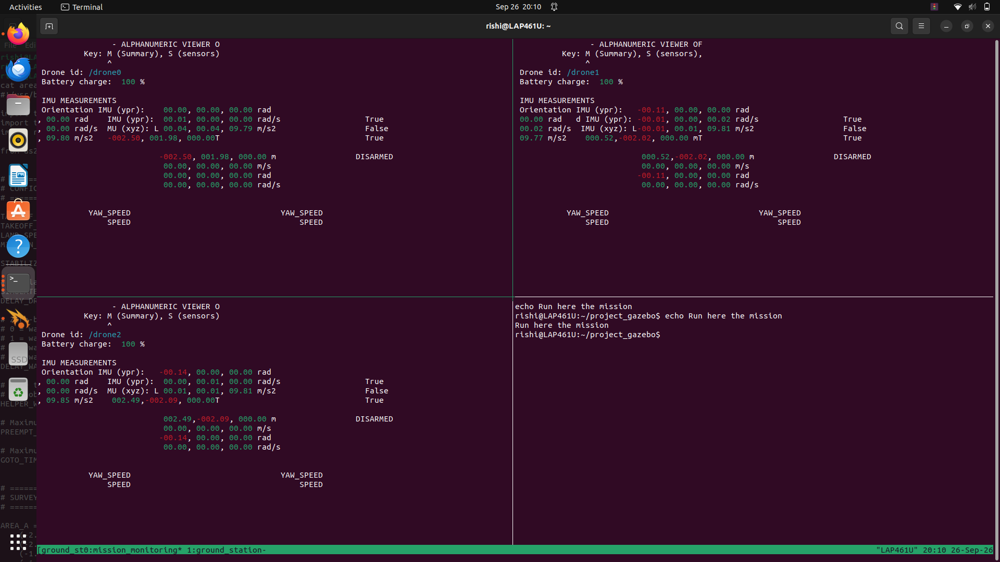 | Live alphanumeric viewer showing IMU/pose/battery telemetry for all three drones prior to mission start. |
| 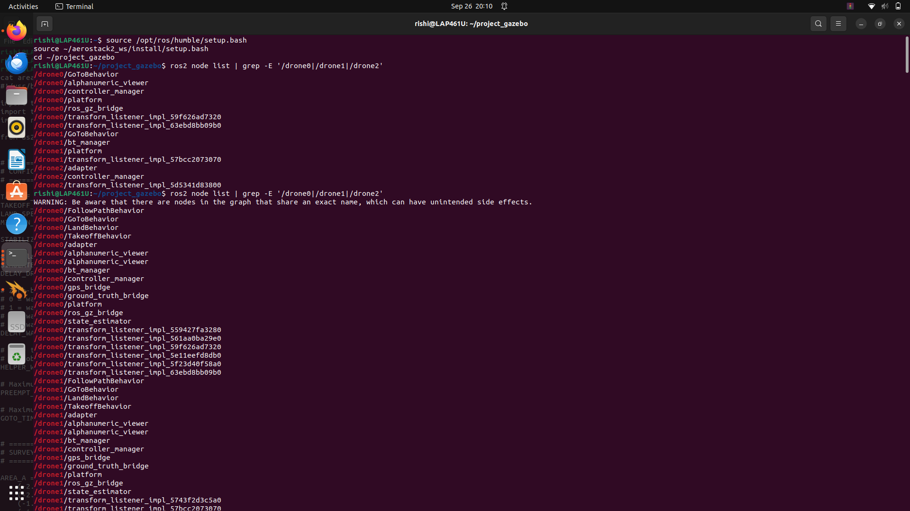 | `ros2 node list` confirming each drone namespace exposes the expected AeroStack2 nodes. |
| 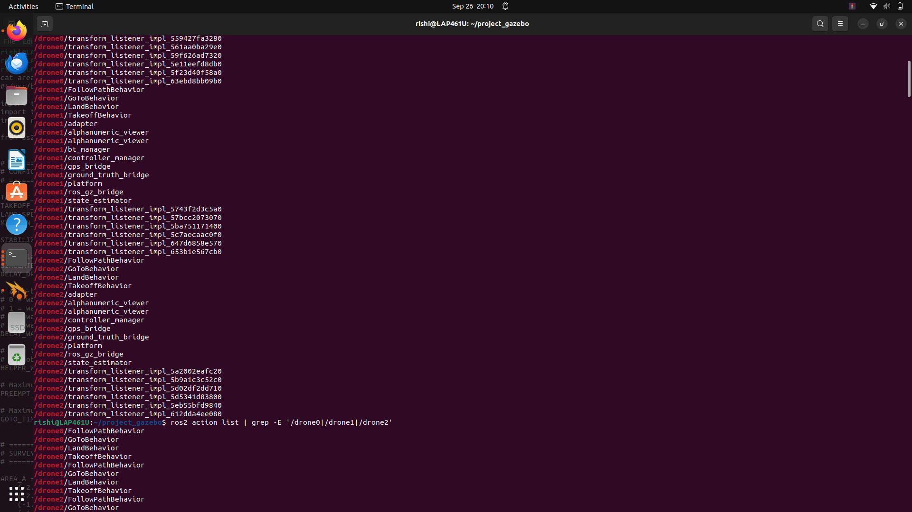 | `ros2 action list` confirming GoTo/Takeoff/Land/FollowPath behaviors are available per drone. |
| 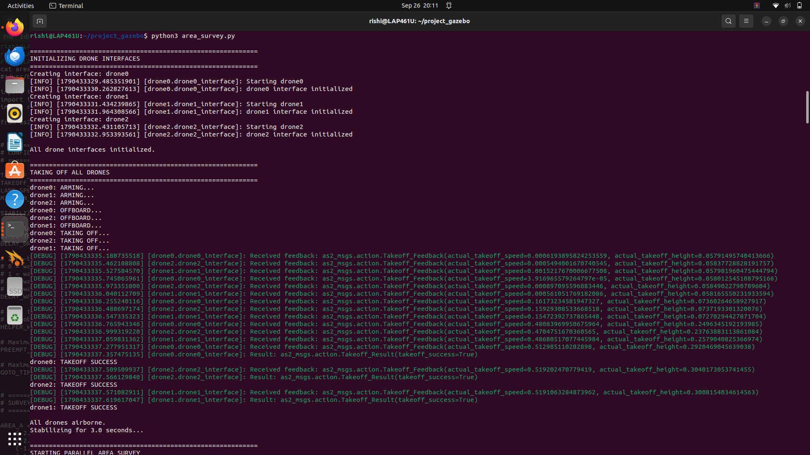 | All three drones initializing, arming, and reporting `TAKEOFF SUCCESS`. |
| 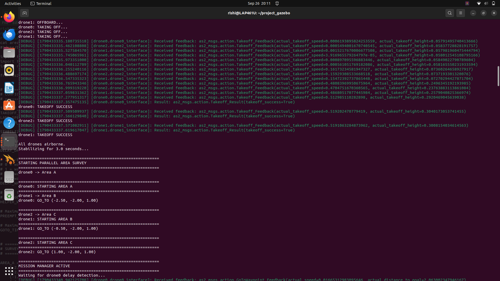 | Parallel area survey beginning — `drone0→A`, `drone1→B`, `drone2→C`. |
| 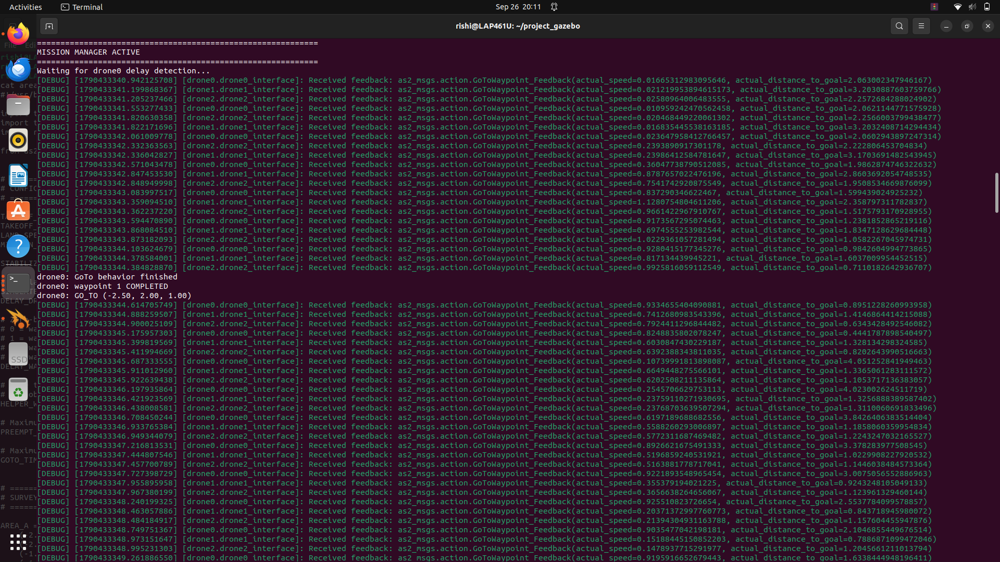 | `drone0` completing waypoint 1, en route to waypoint 2. |
| 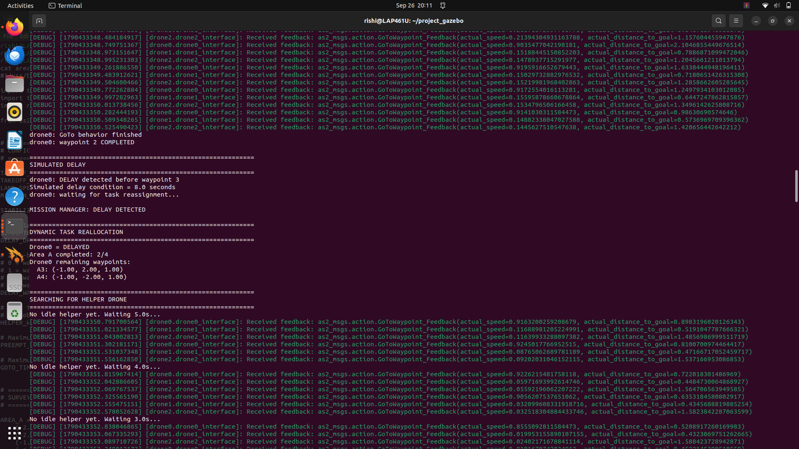 | Simulated 8-second delay triggered before waypoint 3; Mission Manager searching for an idle helper. |
| 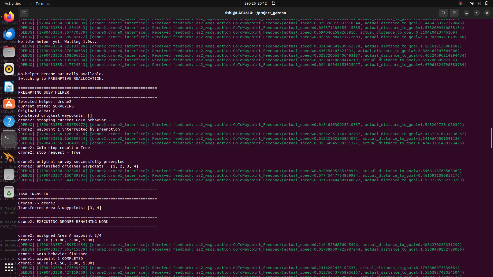 | `drone2` selected as helper and preempted mid-survey; task transfer initiated. |
| 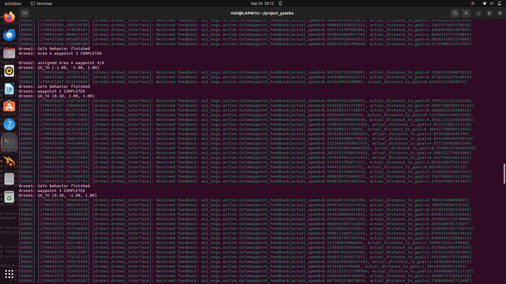 | `drone2` executing `drone0`'s transferred Area A waypoints 3 and 4. |
| 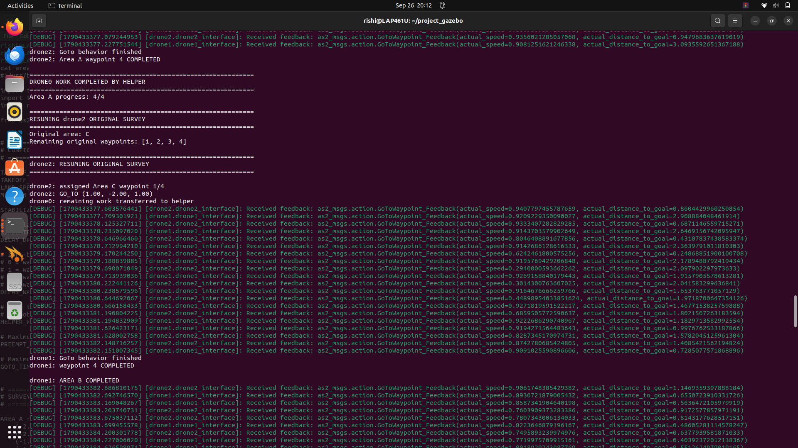 | `drone2` resuming its own original Area C survey after finishing transferred work. |
| 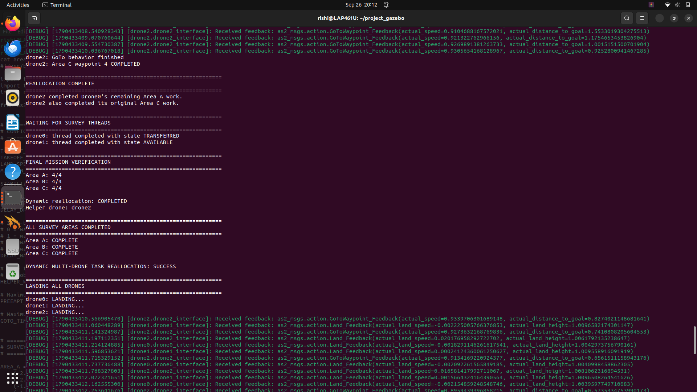 | Final mission verification: Area A/B/C all 4/4; reallocation marked `COMPLETED`. |
| 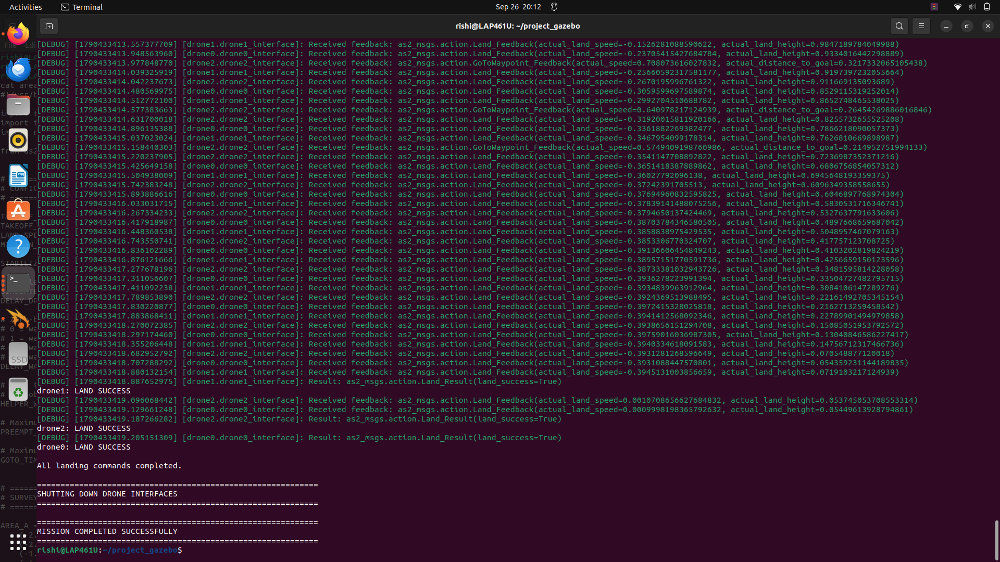 | All drones landing successfully; `MISSION COMPLETED SUCCESSFULLY`. |

## Validation Evidence Summary

| Evidence point | Recorded observation |
|---|---|
| Initialization | All three `DroneInterface` objects initialized |
| Takeoff | `drone0`, `drone1`, `drone2` reported `TAKEOFF SUCCESS` |
| Delay | `drone0` delayed before waypoint 3 after completing waypoint 2 |
| Remaining work | A3 and A4 explicitly listed |
| Helper selection | `drone2` selected after no idle helper became available |
| Preemption | `drone2` active GoTo stopped successfully |
| Transfer | Area A waypoints 3 and 4 transferred to `drone2` |
| Completion | `drone2` completed transferred Area A waypoints |
| Resumption | `drone2` resumed original Area C mission |
| Final verification | Area A 4/4, Area B 4/4, Area C 4/4 |
| Landing | All three drones reported `LAND SUCCESS` |
| Termination | `MISSION COMPLETED SUCCESSFULLY` |

## Conclusion

This project demonstrates mission-level resilience for a three-drone AeroStack2 simulation: independent area assignments, concurrent execution, controlled delay detection, unfinished-work identification, preemption of a busy helper when required, task transfer, and resumption of the helper's original mission. The final validation is especially significant because the helper did not simply finish the transferred work and stop — `drone2` completed `drone0`'s remaining Area A work and then resumed its own Area C workload, with the Mission Manager verifying full coverage across all three areas before issuing landing commands.

Full lifecycle validated: interface initialization → arming → Offboard → concurrent takeoff → parallel area survey → delay detection → helper search → preemption → task transfer → transferred execution → original-task resumption → area verification → landing → clean shutdown.
